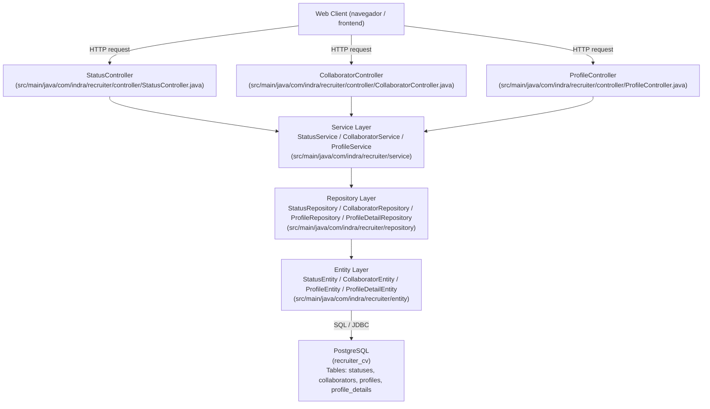

# Flujo de comunicación del backend

Este diagrama describe cómo una petición web viaja desde la capa externa hasta la base de datos en el backend actual.

## Descripción del flujo

1. `WebClient` envía una petición HTTP al backend.
2. Quarkus enruta la petición al controlador correspondiente.
3. El controlador recibe el DTO y llama al servicio.
4. El servicio aplica la lógica de negocio y utiliza el repositorio.
5. El repositorio usa Hibernate ORM y Panache para leer o persistir la entidad.
6. La entidad se mapea a una fila de la tabla en PostgreSQL.
7. La respuesta se devuelve en sentido inverso: entidad -> repositorio -> servicio -> controlador -> cliente.

## Archivos clave

- `backend/src/main/resources/application.properties`
- `backend/src/main/resources/db/migration/V1__create_recruiter_schema.sql`
- `backend/src/main/java/com/indra/recruiter/controller/StatusController.java`
- `backend/src/main/java/com/indra/recruiter/controller/CollaboratorController.java`
- `backend/src/main/java/com/indra/recruiter/controller/ProfileController.java`
- `backend/src/main/java/com/indra/recruiter/service/StatusService.java`
- `backend/src/main/java/com/indra/recruiter/service/CollaboratorService.java`
- `backend/src/main/java/com/indra/recruiter/service/ProfileService.java`
- `backend/src/main/java/com/indra/recruiter/repository/StatusRepository.java`
- `backend/src/main/java/com/indra/recruiter/repository/CollaboratorRepository.java`
- `backend/src/main/java/com/indra/recruiter/repository/ProfileRepository.java`
- `backend/src/main/java/com/indra/recruiter/repository/ProfileDetailRepository.java`
- `backend/src/main/java/com/indra/recruiter/entity/StatusEntity.java`
- `backend/src/main/java/com/indra/recruiter/entity/CollaboratorEntity.java`
- `backend/src/main/java/com/indra/recruiter/entity/ProfileEntity.java`
- `backend/src/main/java/com/indra/recruiter/entity/ProfileDetailEntity.java`
